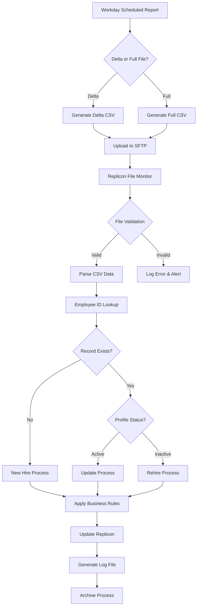

# Interface Design Document (IDD)
## DXC UK & Ireland Workday to Replicon Integration

**Document Version:** 1.0  
**Date:** 2025-08-15  
**Classification:** Technical Design Document

---

## Table of Contents
1. [Executive Summary](#executive-summary)
2. [Interface Architecture](#interface-architecture)
3. [Data Flow Design](#data-flow-design)
4. [Business Logic Specifications](#business-logic-specifications)
5. [Field Mapping and Transformations](#field-mapping-and-transformations)
6. [Validation Rules](#validation-rules)
7. [Error Handling Framework](#error-handling-framework)
8. [Scheduling and Monitoring](#scheduling-and-monitoring)
9. [Performance Considerations](#performance-considerations)
10. [Security and Compliance](#security-and-compliance)

---

## 1. Executive Summary

### 1.1 Purpose
This Interface Design Document defines the technical implementation of the integration between Workday (source system) and Replicon (target system) for DXC UK & Ireland employee data synchronization.

### 1.2 Scope
- **Geographic Coverage:** United Kingdom and Ireland
- **User Base:** CSC and FTP company codes
- **Data Types:** Employee profiles, organizational data, time management configurations
- **Integration Frequency:** Every 6 hours (4 times daily)

### 1.3 Key Business Drivers
- Automated employee lifecycle management
- Real-time organizational hierarchy synchronization
- Elimination of manual data entry
- Compliance with UK & Ireland labor regulations

---

## 2. Interface Architecture

### 2.1 System Architecture

```
┌─────────────┐      ┌──────────────┐      ┌─────────────┐
│   Workday   │ ---> │  SFTP Server │ ---> │  Replicon   │
│   (Source)  │      │ (Transport)  │      │  (Target)   │
└─────────────┘      └──────────────┘      └─────────────┘
       │                    │                      │
       ▼                    ▼                      ▼
  [CSV Export]        [File Transfer]        [Data Import]
                                                   │
                                            ┌──────▼──────┐
                                            │   Logging   │
                                            │   System    │
                                            └─────────────┘
```

### 2.2 Integration Components

| Component | Description | Technology |
|-----------|-------------|------------|
| Data Extractor | Workday report generator | Workday RaaS |
| Transport Layer | Secure file transfer | SFTP Protocol |
| Data Processor | Replicon import engine | Custom Integration |
| Validation Engine | Business rule validator | Replicon API |
| Logger | Audit and error tracking | File-based logging |

### 2.3 Data Format Specifications

- **File Format:** CSV (Comma Separated Values)
- **Character Encoding:** UTF-8
- **Field Delimiter:** Comma (,)
- **Text Qualifier:** Double quotes (")
- **Date Format:** YYYY-MM-DD
- **Time Format:** HH:MM:SS (24-hour)

---

## 3. Data Flow Design

### 3.1 Integration Flow Diagram



### 3.2 File Naming Conventions

| File Type | Naming Pattern | Example |
|-----------|---------------|---------|
| Full File | WD_Replicon_Full_File_YYYYMMDDHHMI.csv | WD_Replicon_Full_File_202506252340.csv |
| Delta File | WD_Replicon_Delta_File_YYYYMMDDHHMI.csv | WD_Replicon_Delta_File_202507041309.csv |
| Log File | Integration_Log_YYYYMMDD_HHMMSS.log | Integration_Log_20250815_143025.log |

---

## 4. Business Logic Specifications

### 4.1 Employee Lifecycle Operations

#### 4.1.1 New Hire Processing

**Trigger:** Employee ID not found in Replicon

**Business Logic:**
```python
def process_new_hire(employee_record):
    # Step 1: Validate required fields
    if not validate_required_fields(employee_record):
        return log_error("Missing required fields")
    
    # Step 2: Create user profile
    user_profile = {
        'first_name': employee_record['First_Name'],
        'last_name': employee_record['Last_Name'],
        'email': employee_record['Email_Address'],
        'employee_id': employee_record['Worker_Reference_Employee_ID'],
        'start_date': employee_record['Hire_Date'],
        'login_name': employee_record['Email_Address'],
        'authentication_type': 'SSO',
        'language': 'English'
    }
    
    # Step 3: Determine timesheet effective date
    if employee_record['Hire_Date'] < '2026-04-01':
        user_profile['timesheet_effective_date'] = '2026-04-01'
    else:
        user_profile['timesheet_effective_date'] = get_week_start(employee_record['Hire_Date'])
    
    # Step 4: Assign supervisor
    supervisor_result = assign_supervisor(employee_record['Manager_ID'])
    if supervisor_result['status'] == 'success':
        user_profile['supervisor'] = supervisor_result['supervisor_id']
    else:
        log_warning(f"Supervisor not found: {employee_record['Manager_ID']}")
    
    # Step 5: Apply role-based assignments
    apply_licensing(user_profile)
    apply_permissions(user_profile)
    apply_time_off_policies(user_profile, employee_record)
    
    return create_user(user_profile)
```

#### 4.1.2 Employee Modification

**Trigger:** Employee ID exists and profile is active

**Business Logic:**
```python
def process_modification(employee_record, existing_profile):
    modifications = {}
    
    # Fields that should be updated
    updatable_fields = [
        'First_Name', 'Last_Name', 'Email_Address', 
        'Login_Name', 'Cost_Center', 'Company_Code'
    ]
    
    for field in updatable_fields:
        if employee_record[field] != existing_profile[field]:
            modifications[field] = employee_record[field]
    
    # Special handling for supervisor changes
    if employee_record['Manager_ID'] != existing_profile['supervisor_id']:
        modifications['supervisor'] = {
            'id': employee_record['Manager_ID'],
            'effective_date': employee_record['supervisor_eff_date'] or today()
        }
    
    # Management level check
    if employee_record['Mgmt_Lvl'] in ['L1', 'L2']:
        modifications['email_notifications'] = False
        modifications['timesheet_enabled'] = False
        modifications['payrule_enabled'] = False
    
    return update_user(existing_profile['id'], modifications)
```

#### 4.1.3 Termination Processing

**Trigger:** Termination date present in feed

**Business Logic:**
```python
def process_termination(employee_record, existing_profile):
    termination_date = employee_record['Termination_Date']
    
    # Step 1: Update end date
    existing_profile['end_date'] = termination_date
    
    # Step 2: Calculate prorated time off
    if termination_date <= today():
        # Immediate termination
        prorate_time_off_balance(existing_profile, termination_date)
        disable_user_profile(existing_profile)
    else:
        # Future termination
        schedule_termination(existing_profile, termination_date)
    
    return update_user(existing_profile)
```

### 4.2 Time Off Proration Logic

#### 4.2.1 Regular Employee Termination

```python
def calculate_prorated_leave(employee, termination_date):
    # Base formula: (Entitlement / 12) * months_worked
    
    entitlements = {
        'annual_leave': employee['annual_leave_balance'],
        'bought_leave': employee['bought_leave_balance'],
        'sold_leave': employee['sold_leave_balance']
    }
    
    total_entitlement = (
        entitlements['annual_leave'] + 
        entitlements['bought_leave'] - 
        entitlements['sold_leave']
    )
    
    months_worked = get_months_between(
        date(year=current_year, month=1, day=1),
        termination_date
    )
    
    prorated_balance = round((total_entitlement / 12) * months_worked)
    
    # Deduct used leave
    final_balance = prorated_balance - employee['leave_used']
    
    # Reset bought and sold leave
    return {
        'annual_leave': final_balance,
        'bought_leave': 0,
        'sold_leave': 0
    }
```

#### 4.2.2 Part-Time Employee Termination

```python
def calculate_prorated_leave_parttime(employee, termination_date):
    # Hours-based calculation for part-time employees
    
    entitlements_hours = {
        'annual_leave_hrs': employee['pt_annual_leave_hrs'],
        'bought_leave_hrs': employee['pt_bought_leave_hrs'],
        'public_holiday_hrs': employee['pt_public_holiday_hrs'],
        'sold_leave_hrs': employee['pt_sold_leave_hrs']
    }
    
    total_entitlement_hrs = sum([
        entitlements_hours['annual_leave_hrs'],
        entitlements_hours['bought_leave_hrs'],
        entitlements_hours['public_holiday_hrs']
    ]) - entitlements_hours['sold_leave_hrs']
    
    months_worked = get_months_between(
        date(year=current_year, month=1, day=1),
        termination_date
    )
    
    prorated_hours = round((total_entitlement_hrs / 12) * months_worked)
    
    # Deduct used hours
    final_balance_hrs = prorated_hours - employee['leave_hours_used']
    
    return {
        'pt_annual_leave_hrs': final_balance_hrs,
        'pt_bought_leave_hrs': 0,
        'pt_public_holiday_hrs': 0,
        'pt_sold_leave_hrs': 0
    }
```

### 4.3 Supervisor Assignment Logic

```python
def assign_supervisor(manager_id, employee_email, effective_date=None):
    # Step 1: Validate supervisor exists
    supervisor = lookup_user_by_id(manager_id)
    
    if not supervisor:
        return {
            'status': 'error',
            'message': f'Supervisor {manager_id} not found in Replicon'
        }
    
    # Step 2: Check supervisor status
    if supervisor['status'] == 'disabled':
        # Reactivate supervisor
        activate_user(supervisor['id'])
        assign_permission(supervisor['id'], 'Manager and Approver')
    
    # Step 3: Verify supervisor permissions
    if 'Manager and Approver' not in supervisor['permissions']:
        assign_permission(supervisor['id'], 'Manager and Approver')
    
    # Step 4: Check for end date conflicts
    if supervisor['end_date'] and supervisor['end_date'] < today():
        return {
            'status': 'error',
            'message': f'Supervisor {manager_id} has past end date'
        }
    
    # Step 5: Set effective date
    if not effective_date or effective_date < today():
        effective_date = today()
    
    return {
        'status': 'success',
        'supervisor_id': supervisor['id'],
        'effective_date': effective_date
    }
```

### 4.4 ERP Transfer Logic

```python
def process_erp_transfer(employee_record, existing_profile):
    old_company_code = existing_profile['company_code']
    new_company_code = employee_record['Company_Code']
    
    # Determine ERPs
    old_erp = get_erp_from_company_code(old_company_code)
    new_erp = get_erp_from_company_code(new_company_code)
    
    if old_erp != new_erp:
        # Step 1: Create new profile
        new_profile = create_user({
            'employee_id': employee_record['Worker_Reference_Employee_ID'],
            'login_name': employee_record['Email_Address'],
            'company_code': new_company_code,
            'timesheet_start': employee_record['Job_Change_effective_date']
        })
        
        # Step 2: Disable old profile
        existing_profile['employee_id'] += f'.{old_erp}'
        existing_profile['login_name'] += f'.{old_erp.lower()}'
        existing_profile['status'] = 'disabled'
        existing_profile['end_date'] = employee_record['Job_Change_effective_date']
        
        update_user(existing_profile)
        
        # Step 3: Handle backdated transfers
        if employee_record['Job_Change_effective_date'] < today():
            delete_time_entries(
                existing_profile['id'],
                employee_record['Job_Change_effective_date']
            )
            force_approve_timesheets(existing_profile['id'])
        
        return new_profile
```

### 4.5 International Assignee Logic

```python
def process_international_assignee(employee_record):
    is_ia = employee_record['is_ia'] == '1'
    
    if is_ia:
        # Employee is on international assignment
        profile_updates = {
            'work_location_country': employee_record['Host_Country'],
            'payroll_country': employee_record['Host_Country'],
            'payrule': get_payrule_for_country(employee_record['Host_Country']),
            'ia_start_date': employee_record['IA_Start_Date'],
            'is_international_assignee': True
        }
    else:
        # Employee returned home
        profile_updates = {
            'work_location_country': employee_record['Home_Country'],
            'payroll_country': employee_record['Home_Country'],
            'payrule': get_payrule_for_country(employee_record['Home_Country']),
            'ia_end_date': today(),
            'is_international_assignee': False
        }
    
    return profile_updates
```

---

## 5. Field Mapping and Transformations

### 5.1 Core User Profile Mapping

| Workday Field | Replicon Field | Transformation Logic | Validation |
|---------------|----------------|---------------------|------------|
| Worker_Reference_Employee_ID | employee_id | Direct mapping | Required, Unique |
| First_Name | first_name | Trim whitespace | Required, Max 50 chars |
| Last_Name | last_name | Trim whitespace | Required, Max 50 chars |
| Email_Address | email, login_name, auth_id | Lowercase transformation | Required, Valid email format |
| Hire_Date | start_date | Date format: YYYY-MM-DD | Required, Valid date |
| Termination_Date | end_date | Date format: YYYY-MM-DD | Optional, Valid date |
| Manager_ID | supervisor_id | Lookup validation | Optional, Must exist |
| Company_Code | company_code | Direct mapping | Required, Valid code |
| Cost_Center | cost_center | Create if not exists | Required |
| Work_Location_Country | location_country | Country code mapping | Required |

### 5.2 Schedule and Time Management Mapping

| Workday Field | Replicon Field | Transformation Logic |
|---------------|----------------|---------------------|
| work_shift | office_schedule | 1:1 mapping with validation |
| work_shift_eff_date | schedule_effective_date | Date validation |
| Additional_Job_Classifications | custom_field_classification | Determines payrule and timesheet template |
| Job_Change_effective_date | change_effective_date | Used for multiple assignments |
| FTE_Percent | fte_percentage | Decimal conversion |

### 5.3 Time Off Specific Mapping

| Workday Field | Replicon Field | Business Rule |
|---------------|----------------|---------------|
| Holiday_Schedule_Calendar | holiday_calendar | Must match existing calendar name |
| Employee_Representative_Status | emp_rep_custom_field | Yes/No with effective date |
| Employee_Representative_Effective_Date | emp_rep_effective_date | Enables/disables specific time offs |

### 5.4 Display Name Generation

```python
def generate_display_name(employee_record):
    # Format: "LastName, FirstName - EmployeeID (Email)"
    last_name = employee_record['Last_Name']
    first_name = employee_record['First_Name']
    employee_id = employee_record['Worker_Reference_Employee_ID']
    email = employee_record['Email_Address']
    
    display_name = f"{last_name}, {first_name} - {employee_id} ({email})"
    
    return display_name[:100]  # Limit to 100 characters
```

---

## 6. Validation Rules

### 6.1 Field-Level Validations

```python
FIELD_VALIDATIONS = {
    'Worker_Reference_Employee_ID': {
        'required': True,
        'type': 'string',
        'pattern': r'^[A-Z0-9]{1,20}$',
        'unique': True
    },
    'Email_Address': {
        'required': True,
        'type': 'email',
        'pattern': r'^[a-zA-Z0-9._%+-]+@dxc\.com$'
    },
    'Hire_Date': {
        'required': True,
        'type': 'date',
        'format': '%Y-%m-%d',
        'min': '2000-01-01',
        'max': 'today+365'
    },
    'Company_Code': {
        'required': True,
        'type': 'string',
        'values': ['0201', '0290', '1627', '0250', '1629', '1639', '1631', '1630', '1628', '0237']
    },
    'Mgmt_Lvl': {
        'required': False,
        'type': 'string',
        'values': ['L1', 'L2', 'L3', 'L4', 'L5', '']
    },
    'FTE_Percent': {
        'required': True,
        'type': 'decimal',
        'min': 0,
        'max': 100
    }
}
```

### 6.2 Cross-Field Validations

```python
def validate_cross_fields(record):
    errors = []
    
    # Termination date must be after hire date
    if record.get('Termination_Date'):
        if record['Termination_Date'] <= record['Hire_Date']:
            errors.append('Termination date must be after hire date')
    
    # Supervisor cannot be self
    if record['Manager_ID'] == record['Worker_Reference_Employee_ID']:
        errors.append('Employee cannot be their own supervisor')
    
    # Part-time validation
    if float(record['FTE_Percent']) < 100:
        if not record.get('PT_Schedule'):
            errors.append('Part-time employees require PT schedule')
    
    # International assignee validation
    if record.get('is_ia') == '1':
        if not record.get('Host_Country'):
            errors.append('International assignees require host country')
    
    return errors
```

### 6.3 Business Rule Validations

```python
def validate_business_rules(record, context):
    warnings = []
    
    # Check supervisor exists and is active
    if record.get('Manager_ID'):
        supervisor = context.lookup_user(record['Manager_ID'])
        if not supervisor:
            warnings.append(f"Supervisor {record['Manager_ID']} not found")
        elif supervisor['status'] == 'terminated':
            warnings.append(f"Supervisor {record['Manager_ID']} is terminated")
    
    # Validate holiday calendar exists
    if record.get('Holiday_Schedule_Calendar'):
        if not context.calendar_exists(record['Holiday_Schedule_Calendar']):
            warnings.append(f"Holiday calendar {record['Holiday_Schedule_Calendar']} not found")
    
    # Validate cost center
    if not context.cost_center_exists(record['Cost_Center']):
        warnings.append(f"Cost center {record['Cost_Center']} will be created")
    
    return warnings
```

---

## 7. Error Handling Framework

### 7.1 Error Categories

| Category | Severity | Action | Example |
|----------|----------|--------|---------|
| CRITICAL | Fatal | Stop processing | Database connection failure |
| ERROR | High | Skip record, log | Missing required field |
| WARNING | Medium | Process with warning | Supervisor not found |
| INFO | Low | Log only | New cost center created |

### 7.2 Error Processing Logic

```python
class ErrorHandler:
    def __init__(self):
        self.errors = []
        self.warnings = []
        self.processed_count = 0
        self.failed_count = 0
    
    def handle_error(self, record, error_type, message):
        error_entry = {
            'timestamp': datetime.now(),
            'employee_id': record.get('Worker_Reference_Employee_ID'),
            'error_type': error_type,
            'message': message,
            'record_data': record
        }
        
        if error_type == 'CRITICAL':
            self.log_critical(error_entry)
            raise IntegrationException(message)
        elif error_type == 'ERROR':
            self.errors.append(error_entry)
            self.failed_count += 1
            self.log_error(error_entry)
        elif error_type == 'WARNING':
            self.warnings.append(error_entry)
            self.processed_count += 1
            self.log_warning(error_entry)
    
    def generate_summary(self):
        return {
            'total_records': self.processed_count + self.failed_count,
            'successful': self.processed_count,
            'failed': self.failed_count,
            'warnings': len(self.warnings),
            'errors': self.errors,
            'warnings_detail': self.warnings
        }
```

### 7.3 Retry Logic

```python
def process_with_retry(record, max_retries=3):
    retry_count = 0
    last_error = None
    
    while retry_count < max_retries:
        try:
            result = process_record(record)
            return result
        except TemporaryError as e:
            retry_count += 1
            last_error = e
            wait_time = 2 ** retry_count  # Exponential backoff
            time.sleep(wait_time)
        except PermanentError as e:
            log_error(f"Permanent error: {e}")
            raise
    
    log_error(f"Max retries exceeded: {last_error}")
    raise last_error
```

---

## 8. Scheduling and Monitoring

### 8.1 Schedule Configuration

| Schedule Type | Frequency | Time (UTC) | File Type |
|--------------|-----------|------------|-----------|
| Full Sync | Daily | 00:00 | Full File |
| Delta Sync 1 | Daily | 06:00 | Delta File |
| Delta Sync 2 | Daily | 12:00 | Delta File |
| Delta Sync 3 | Daily | 18:00 | Delta File |

### 8.2 Monitoring Framework

```python
class IntegrationMonitor:
    def __init__(self):
        self.metrics = {
            'last_run_time': None,
            'last_success_time': None,
            'consecutive_failures': 0,
            'average_processing_time': 0,
            'records_per_minute': 0
        }
    
    def monitor_integration(self):
        # Check file arrival
        if not self.check_file_arrival():
            self.alert('File not received within SLA')
        
        # Monitor processing time
        if self.get_processing_duration() > self.sla_threshold:
            self.alert('Processing time exceeded SLA')
        
        # Check error rate
        error_rate = self.calculate_error_rate()
        if error_rate > 0.05:  # 5% threshold
            self.alert(f'High error rate: {error_rate:.2%}')
        
        # Check for stuck processes
        if self.is_process_stuck():
            self.alert('Integration process appears stuck')
    
    def generate_metrics_report(self):
        return {
            'uptime': self.calculate_uptime(),
            'success_rate': self.calculate_success_rate(),
            'average_latency': self.calculate_average_latency(),
            'peak_processing_time': self.get_peak_processing_time()
        }
```

### 8.3 Alert Configuration

| Alert Type | Condition | Recipients | Action |
|------------|-----------|------------|--------|
| File Missing | No file received in 30 min | Support Team | Check SFTP connectivity |
| High Error Rate | >5% records failed | Dev Team | Review error logs |
| Processing Delay | >2 hours processing | Operations | Check system resources |
| Critical Error | Integration stopped | All Teams | Immediate investigation |

---

## 9. Performance Considerations

### 9.1 Optimization Strategies

```python
class PerformanceOptimizer:
    def __init__(self):
        self.batch_size = 1000
        self.parallel_workers = 4
        self.cache = {}
    
    def optimize_processing(self, records):
        # Batch processing
        batches = self.create_batches(records, self.batch_size)
        
        # Parallel processing
        with ThreadPoolExecutor(max_workers=self.parallel_workers) as executor:
            futures = []
            for batch in batches:
                future = executor.submit(self.process_batch, batch)
                futures.append(future)
            
            results = []
            for future in futures:
                results.extend(future.result())
        
        return results
    
    def cache_lookups(self):
        # Pre-cache frequently accessed data
        self.cache['supervisors'] = self.load_all_supervisors()
        self.cache['cost_centers'] = self.load_all_cost_centers()
        self.cache['calendars'] = self.load_all_calendars()
    
    def use_bulk_operations(self, operations):
        # Group similar operations
        grouped = self.group_by_operation_type(operations)
        
        for op_type, ops in grouped.items():
            if op_type == 'create':
                self.bulk_create(ops)
            elif op_type == 'update':
                self.bulk_update(ops)
```

### 9.2 Performance Metrics

| Metric | Target | Measurement |
|--------|--------|-------------|
| File Processing Time | <30 min for 10K records | End-to-end time |
| Record Processing Rate | >500 records/minute | Records per minute |
| Memory Usage | <2GB | Peak memory consumption |
| API Response Time | <500ms | Average API latency |
| Database Query Time | <100ms | Average query execution |

---

## 10. Security and Compliance

### 10.1 Data Security Measures

```python
class SecurityHandler:
    def __init__(self):
        self.encryption_key = self.load_encryption_key()
        self.audit_logger = AuditLogger()
    
    def secure_transport(self, file_path):
        # Encrypt file before transport
        encrypted_file = self.encrypt_file(file_path)
        
        # Verify checksum
        checksum = self.calculate_checksum(encrypted_file)
        
        # Secure transfer
        sftp_config = {
            'host': os.environ['SFTP_HOST'],
            'port': 22,
            'username': os.environ['SFTP_USER'],
            'private_key': self.load_private_key(),
            'host_key_verification': True
        }
        
        return self.transfer_file(encrypted_file, sftp_config)
    
    def mask_sensitive_data(self, record):
        # Mask PII in logs
        masked_record = record.copy()
        sensitive_fields = ['SSN', 'BankAccount', 'NationalID']
        
        for field in sensitive_fields:
            if field in masked_record:
                masked_record[field] = 'XXXX' + masked_record[field][-4:]
        
        return masked_record
    
    def audit_access(self, user, action, record):
        self.audit_logger.log({
            'timestamp': datetime.now(),
            'user': user,
            'action': action,
            'record_id': record.get('Worker_Reference_Employee_ID'),
            'ip_address': self.get_client_ip(),
            'session_id': self.get_session_id()
        })
```

### 10.2 Compliance Requirements

| Requirement | Implementation | Validation |
|-------------|---------------|------------|
| GDPR Compliance | Data minimization, right to erasure | Quarterly audit |
| UK Data Protection | Encrypted storage and transport | Security assessment |
| Access Control | Role-based permissions | Access reviews |
| Audit Trail | Comprehensive logging | Log retention 7 years |
| Data Retention | Automated purging after retention period | Monthly verification |

### 10.3 Access Control Matrix

| Role | Read | Create | Update | Delete | Approve |
|------|------|--------|--------|--------|---------|
| System Admin | ✓ | ✓ | ✓ | ✓ | ✓ |
| Integration Service | ✓ | ✓ | ✓ | ✗ | ✗ |
| Support Team | ✓ | ✗ | ✗ | ✗ | ✗ |
| Audit Team | ✓ | ✗ | ✗ | ✗ | ✗ |

---

## Appendices

### Appendix A: Error Codes

| Code | Description | Resolution |
|------|-------------|------------|
| E001 | Missing required field | Verify source data completeness |
| E002 | Invalid date format | Check date field formatting |
| E003 | Supervisor not found | Create supervisor profile first |
| E004 | Duplicate employee ID | Check for existing profile |
| E005 | Invalid company code | Verify company code mapping |
| W001 | Cost center created | Informational - no action needed |
| W002 | Future termination date | Will be processed on date |
| W003 | No supervisor assigned | Manual assignment may be needed |

### Appendix B: Sample Log File Format

```json
{
  "integration_run": {
    "run_id": "20250815-143025",
    "start_time": "2025-08-15T14:30:25Z",
    "end_time": "2025-08-15T14:45:32Z",
    "file_name": "WD_Replicon_Delta_File_202508151400.csv",
    "summary": {
      "total_records": 1523,
      "processed": 1498,
      "failed": 25,
      "new_hires": 45,
      "updates": 1453,
      "terminations": 12,
      "warnings": 38
    },
    "errors": [
      {
        "employee_id": "E12345",
        "error": "E003",
        "message": "Supervisor S98765 not found",
        "action": "Record processed without supervisor"
      }
    ],
    "performance": {
      "processing_time_seconds": 907,
      "records_per_minute": 100.5,
      "peak_memory_mb": 1250
    }
  }
}
```

### Appendix C: Testing Scenarios

| Test Case | Description | Expected Result |
|-----------|-------------|-----------------|
| TC001 | New hire with all fields | User created successfully |
| TC002 | Update existing user | Fields updated with history |
| TC003 | Terminate user mid-month | Prorated leave calculation |
| TC004 | Rehire terminated user | Profile reactivated |
| TC005 | ERP transfer | New profile created, old disabled |
| TC006 | Missing supervisor | User created with warning |
| TC007 | Future termination | Scheduled for processing |
| TC008 | International assignee | Payrule updated to host country |

---

## Document Control

| Version | Date | Author | Changes |
|---------|------|--------|---------|
| 1.0 | 2025-08-15 | System | Initial version based on specifications |

## Sign-Off

| Role | Name | Signature | Date |
|------|------|-----------|------|
| Technical Lead | _____________ | _____________ | _____ |
| Business Analyst | _____________ | _____________ | _____ |
| QA Lead | _____________ | _____________ | _____ |
| Project Manager | _____________ | _____________ | _____ |