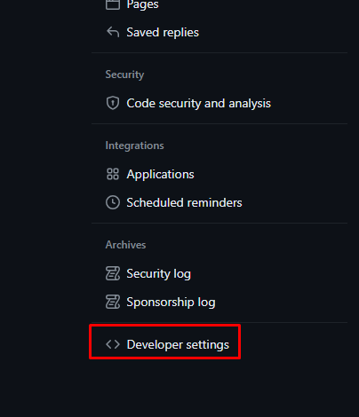
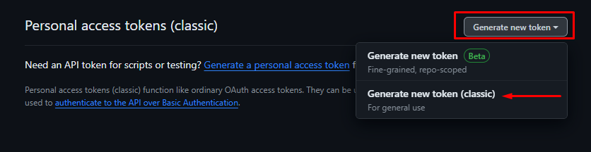
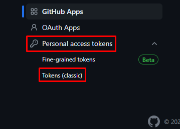
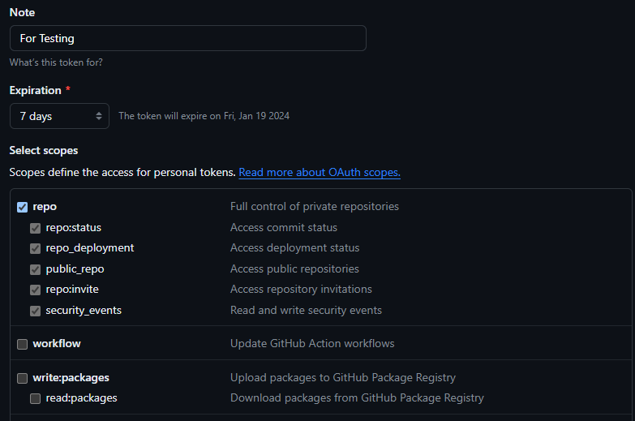
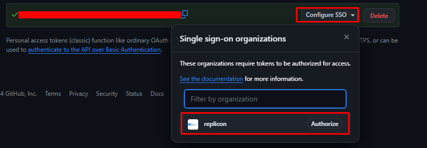

# Airflow Disable Inactive Dags Automation

The workflow will search all the inactive dags where the last execution_date is more than 60 days old for the current environment and will open a pull request against the airflow-integration repository using the GitHub REST API's.

# How the workflow works

- The Integration will make use of **Airflow DataBase** to query the inactive dags with the help of **SQLAlchemy** library

- Once the details are fetched from the database the workflow will identify the delta instance files that needs to be updated with **_disabled = True_**

- Integration will create a branch against the airflow-integration repository
  with **Branch Base Name**: **_IP2-4361_disable_inactive_dags_** and concatenating the automation hosted environment and run time with the base name time format : `%Y%m%dT%H%M%S`<br> Example: **IP2-4361_disable_inactive_dags_eu-central-1-pre-production_20240325T164621**

- Integration will find delta files to be updated based on below:
    - The integration folder path is not available in the ignore list stored in the Airflow variable
        - Airflow variable name: `airflow_disable_inactive_dags_ignore_integrations_details`
        - Value will be stored in JSON format.
        - Stored value format: 
            ```
            {
                "ignore_list" : []
            }
            ```
            - the ignore_list is a list which contains the companyKey(tenant) integration folder in `company_key/integration_folder` format.
            - e.g 
            ```
            {
                "ignore_list":["mammoet/user_import", "dxctechnology/workday_user_import/disable_user"]
            }
            ```
    - Last commit date on the integration folder within 14 Days.
    - The automation will find all the integration dags associated with the file and below checks will be performed,
        - If there is no dag_run for the entire integration set (Dags can be active or inactive status)
            - Integration will be disabled.
        - There is a dag_run of any dag for the integration set and it is older than today(automation run date) - 60 Days
            - is all the dags in the integration are in disabled state?
                - Yes, Integration will be disabled.
     
- The necessary changes will be made to the delta instance file and will be pushed to the newly created branch.

- The commit will be done per delta file with commit message as **_For `tenant`'s integration `integration-folder-name`, updated `instance-file-name-with-extension`_** </br>
  Example: **For mammoet's integration time_export, updated trial.py**

- Once all the delta file changes are done, a pull request will opened with title **IP2-4361 | Disable Airflow inactive dags/integrations region-environment**

- An Email notification will be sent to Replicon Integration Team with Branch and Pull Request details. Also all the inactive dags details will be attached as an CSV attachment.

- The reference variable which stores the previously updated instance files(via automation only) will be updated with unique file paths with the latest branch and pull request details.
    - Airflow variable name: **_airflow_disable_inactive_dags_previously_changed_filepaths_details_**
    - Value format: JSON
    - Value 
         ```
            {
                "filepath_list": [],
                "last_branch_name": "<branch_name>",
                "last_pull_request": "<pull_request_url>"
            }
<br>

# GitHub User 

- A dedicated user will be created with write permission on airflow-integration repository for this automation only. 
- The dedicated user **will not** have self merge permissions assigned to avoid unnessary merges

<br>

# GitHub REST API User Authentication

- For authentication, Bearer token will be used

 ### Steps to create GitHub Bearer Token

- Login to GitHub
- On Top-Right click on your profile icon and go to `Settings`
- Scroll down till you see `Developer Settings`
    
    

- Once you opened `Developer Settings` Click on `Personal Access Token` -> `Tokens (Classic)`

    

- You will see a Click on Generate new token dropdown and select Generate new token (classic)

    

- Once Authenticated, Do the following
    - Add Note
    - Select necessary scopes for the token (For this automation `repo` scope is madeatory)
    - expiration period

        

    - Scroll to the bottom and click `Generate Token`

- Copy the token (*Note*: You won’t be able to see it again!)
- Authorize the generated token for the Replicon Org.

    

- Now you can use the token and authenticate yourself by sending the token in headers while making the API call