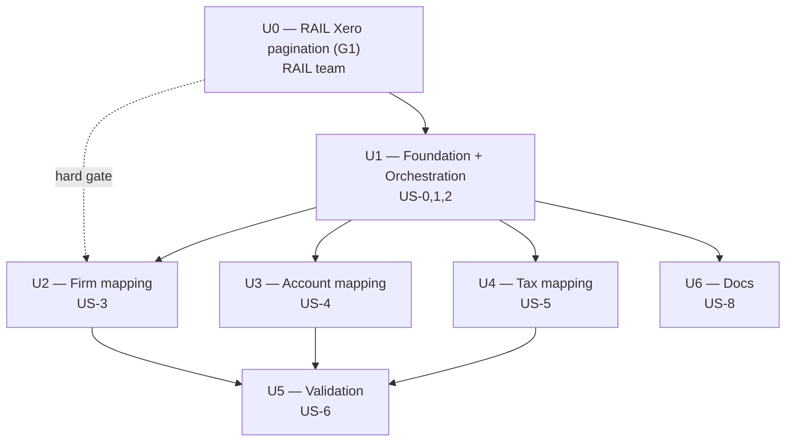

# Unit Dependency & Sequencing

## Dependency graph

## Critical path
`U0 (RAIL pagination) → U1 (foundation/dispatcher) → U2 (firm) → U5 (validation)`

- **U0** is the longest-lead external item (owned by the RAIL team) and **hard-gates U2** (firm needs paginated `/Contacts`).
- **U3 (account)** and **U4 (tax)** can run in parallel with U2 once **U1** lands; their list reads are small, so they are not strictly gated by U0/G1 (but should adopt pagination once available).
- **U5 (validation)** is the join point — needs U2, U3, U4.
- **U6 (docs)** runs alongside, finalized at the end.

## Parallelization plan
| Wave | Units | Notes |
| --- | --- | --- |
| 1 | **U0** | Start immediately (RAIL team); unblocks U2. |
| 1 | **U1** | Start in parallel (scaffold from QBO); no U0 runtime dependency for scaffolding. |
| 2 | **U2**, U3, U4 | After U1. U2 also waits on U0/G1 for correct reads; U3/U4 not gated. |
| 3 | **U5** | After U2+U3+U4. |
| — | U6 | Any time after U1; finalize at end. |

## External / cross-team dependencies
- **U0 → RAIL team**: pagination (G1) is the only hard external dependency for this effort. Raise early. If U0 slips, U3/U4/U1 proceed; U2 can be built and unit-tested against a single page, with the pagination wired in when G1 lands.

## Risk-to-unit mapping (from execution plan §1)
| Risk | Unit(s) | Handling |
| --- | --- | --- |
| R1 RAIL pagination gap | U0 → U2 | sequence U0 first; build U2 test-first against single page |
| R2 matching/compile correctness | U2, U3, U4 | functional design + US-6 validation + parity-doc spec |
| R3 multi-tenant + idempotency | U1 | NFR (light) at U1, inherited |
| R4 reproducing Workato bugs | U2, U3, U4, U5 | fix-list (Q9) + per-table fix-logs (U6) |
| R5 Xero rate limits | U0, U1 | 429 retry (existing) + NFR note |
